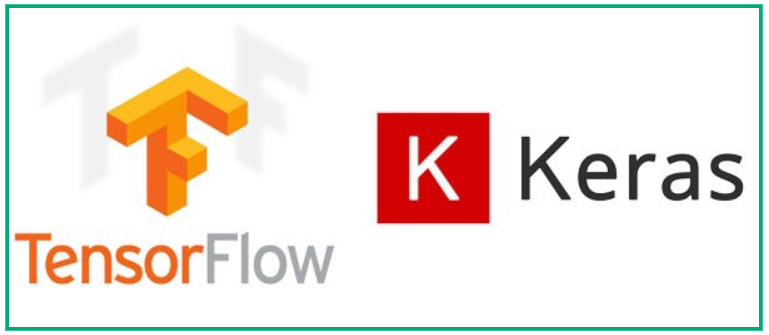
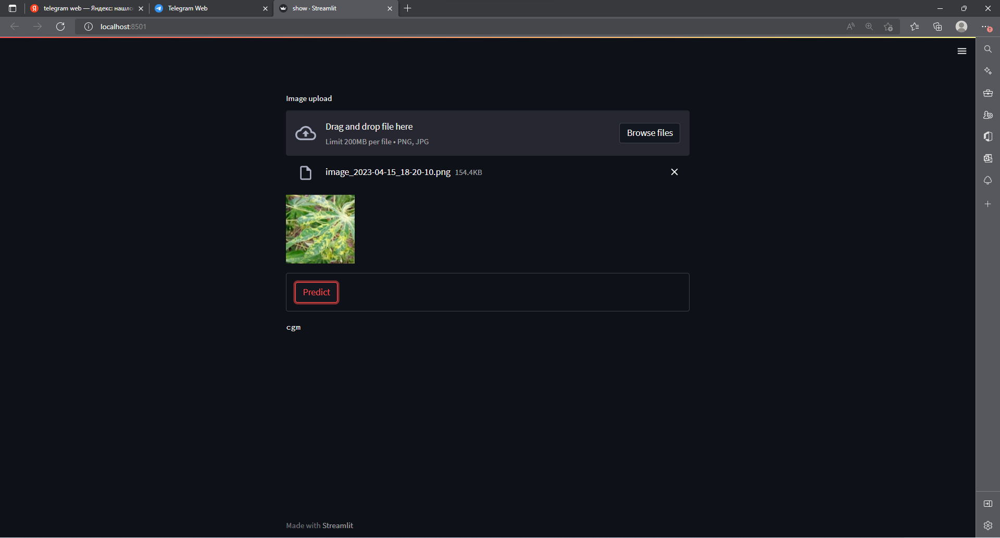
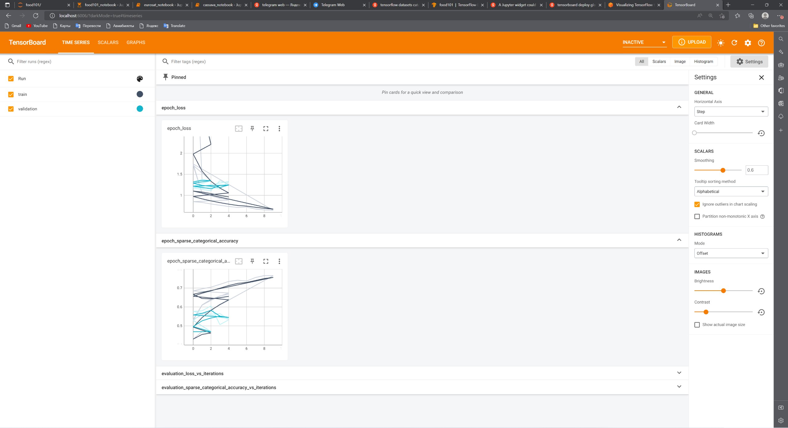

# cassava
 
<a name="readme-top"></a>


<!-- PROJECT LOGO -->
<br />
<div align="center">
  <a href="https://github.com/FreckledMe/cassava">
    
  </a>


  <p align="center">

  </p>
</div>


<!-- TABLE OF CONTENTS -->
<details>
  <summary>Table of Contents</summary>
  <ol>
    <li>
      <a href="#about-the-project">About The Project</a>
      <ul>
        <li><a href="#built-with">Built With</a></li>
      </ul>
      <ul>
        <li><a href="#installation">Installation</a></li>
      </ul>
    </li>
    <li><a href="#contact">Contact</a></li>
  </ol>
</details>


<!-- ABOUT THE PROJECT -->
## About The Project


As the 2nd largest provider of carbohydrates in Africa, cassava is a key food security crop grown by small-holder farmers because it can withstand harsh conditions. At least 80% of small-holder farmer households in Sub-Saharan Africa grow cassava and viral diseases are major sources of poor yields.

In this competition, we introduce a dataset of 5 fine-grained cassava leaf disease categories with 9,436 labeled images collected during a regular survey in Uganda, mostly crowdsourced from farmers taking images of their gardens, and annotated by experts at the National Crops Resources Research Institute (NaCRRI) in collaboration with the AI lab in Makarere University, Kampala.

The dataset consists of leaf images of the cassava plant, with 9,436 annotated images and 12,595 unlabeled images of cassava leaves. Participants can choose to use the unlabeled images as additional training data. The goal is to learn a model to classify a given image into these 4 disease categories or a 5th category indicating a healthy leaf, using the images in the training data (participants can choose to use the unlabeled images in their training data). This competition is part of the fine-grained visual-categorization workshop (FGVC6 workshop) at CVPR 2019.

Acknowledgements
We thank the different experts and collaborators from NaCRRI for assisting in preparing this dataset

Citation
Please cite this paper if you use the dataset for your project: https://arxiv.org/pdf/1908.02900.pdf

![Product Name Screen Shot][product-screenshot]

<p align="right">(<a href="#readme-top">back to top</a>)</p>


### Built With

* [![Python][Python]][Python-url]
* [![Tensorflow][Tensorflow]][T-url]
* [![Jupyter Notebook][Jupyter]][J-url]
* <a href="https://streamlit.io/"> </a>
<p align="right">(<a href="#readme-top">back to top</a>)</p>
 


### Installation


1. Clone the repo and extract zip file
   ```sh
   git clone https://github.com/FreckledMe/cassava.git
   ```
2. Open a terminal via this extracted folder location
   ```sh
   pip install virtualenv
   ```
3. Create environment for project
   ```sh
   python<version> -m venv <virtual-environment-name>
   ```
4. Activate environment
   ```sh
   environment_path\<virtual-environment-name>\Scripts\activate
   ```
5. Install required libraries
   ```sh
   (virtual-environment-name) pip install -r requirements.txt
   ```
6. Run [rock_paper_scissors.ipynb ](https://github.com/FreckledMe/rock_paper_scissors/blob/main/rock_paper_scissors.ipynb)

<p align="right">(<a href="#readme-top">back to top</a>)</p>


<!-- USAGE EXAMPLES -->
## Usage
   Use [Streamlit](https://github.com/streamlit/streamlit)
   ```sh 
   (virtual-environment-name)/streamlit run stream.py
   ```
Example result



   View loss and accuracy in per epoch via [Tensorboard](https://github.com/tensorflow/tensorboard)
   ```sh
   (virtual-environment-name)/tensorboard --logdir logs
   ```
Example result




<p align="right">(<a href="#readme-top">back to top</a>)</p>

## Contact

[![LinkedIn][linkedin-shield]][linkedin-url]

<a href="mailto:justfrozenak@gmail.com"> </a>

<p align="right">(<a href="#readme-top">back to top</a>)</p>


<!-- MARKDOWN LINKS & IMAGES -->

[linkedin-shield]: https://img.shields.io/badge/-LinkedIn-black.svg?style=for-the-badge&logo=linkedin&colorB=555
[linkedin-url]: https://www.linkedin.com/in/kamoliddin-jabbarov-599b56201/
[product-screenshot]: images/img.png

[Python]: https://staging.python.org/static/community_logos/python-powered-w-70x28.png
[Python-url]: https://python.org/
[Tensorflow]:  https://img.shields.io/badge/TensorFlow-FF6F00?style=for-the-badge&logo=tensorflow&logoColor=white
[T-url]: https://www.tensorflow.org/
[Jupyter]: https://img.shields.io/badge/jupyter-%23FA0F00.svg?style=for-the-badge&logo=jupyter&logoColor=white
[J-url]: https://jupyter.org/